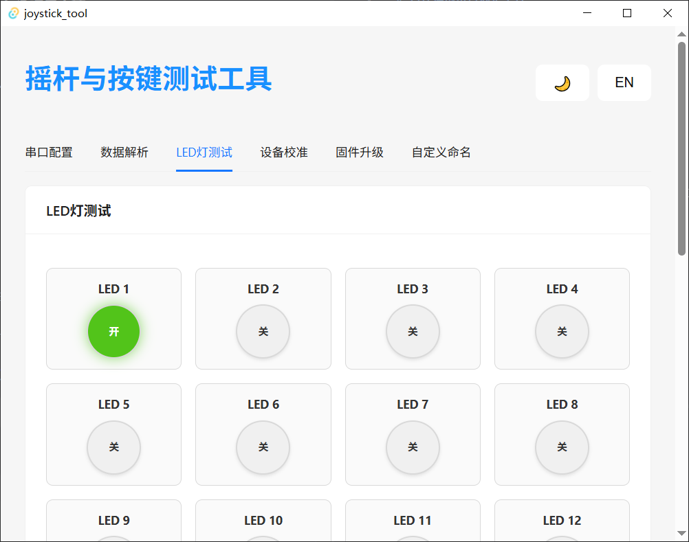

# 摇杆按键串口解析工具

这是一个基于 Tauri + React + Rust 开发的摇杆按键串口解析工具，用于通过串口通信接收和解析摇杆、按键、ADC和LED设备的数据，并提供可视化界面和控制功能。

## 界面截图





## 技术栈

- **前端框架**: React 18 + Vite
- **构建工具**: Tauri（跨平台桌面应用框架）
- **后端语言**: Rust
- **UI 组件库**: Ant Design
- **状态管理**: React Hooks
- **国际化**: i18next
- **串口通信**: Rust serialport 库

## 功能特性

### 1. 串口通信管理
- 自动扫描可用串口
- 支持多种波特率选择（9600, 38400, 57600, 115200）
- 连接状态实时监控
- 手动刷新串口列表和设备状态

### 2. 数据解析与可视化
- 24个按键状态实时显示
- 14个ADC通道数据可视化（带进度条）
- 20个LED状态实时监控
- 原始数据帧解析与显示
- 数据有效性验证

### 3. LED灯测试
- 20个LED灯独立控制
- 可视化开关状态
- 实时显示发送的指令

### 4. 设备校准
- 通道使能控制
- 多种校准模式（自动/手动）
- 支持中心点和量程校准
- 支持摇杆、电位器、按键设备
- 自动生成校准指令

### 5. 自定义名称
- 支持为按键、ADC通道、LED灯自定义名称
- 配置自动保存

### 6. 用户界面
- 响应式设计，适配不同屏幕尺寸
- 支持明暗主题切换
- 支持中英文语言切换
- 简洁直观的操作界面
- 系统托盘支持

## 通信协议

应用通过串口接收设备数据帧，并发送控制指令：
- 数据帧解析：支持固定格式的数据帧，包含按键、ADC和LED状态
- 校准指令：`81 10 XX XX XX XX XX 00 YY` 格式的校准命令
- LED控制指令：`CC XX YY BF` 格式的LED控制命令

## 安装和运行

### 开发环境

1. 安装 Rust 和 Cargo
2. 安装 Node.js 和 npm
3. 安装 Tauri CLI

### 运行项目

```bash
# 安装依赖
npm install

# 开发模式运行
npm run tauri dev

# 构建生产版本
npm run tauri build
```

## 项目结构

- `src/`: 前端代码（React）
  - `locales/`: 国际化资源文件
  - `assets/`: 静态资源
- `src-tauri/`: 后端代码（Rust）
  - `src/matrix.rs`: 数据解析核心逻辑
  - `src/serial.rs`: 串口通信实现
  - `src/config.rs`: 配置文件管理
  - `src/tray.rs`: 系统托盘实现
- `public/`: 静态资源

## 使用说明

1. 启动应用后，首先选择可用的串口和波特率
2. 点击"连接"按钮与设备建立连接
3. 在"数据解析"页面查看按键、ADC和LED状态
4. 在"LED测试"页面控制LED灯开关
5. 在"校准"页面进行设备校准
6. 在"自定义名称"页面编辑设备名称

## 配置文件

应用会在本地生成 `config.json` 文件，保存以下配置：
- 串口配置（端口、波特率）
- 设备名称自定义配置
- 应用主题和语言设置

## 注意事项

- 确保设备支持相同的通信协议
- 连接设备前请确认串口参数设置正确
- 操作过程中请勿关闭应用或断开设备连接
- 设备校准前请仔细阅读校准说明

## 功能模块

### 仪表盘
- 串口连接管理
- 端口和波特率选择
- 连接状态显示

### 数据解析
- 按键状态实时显示
- ADC数据可视化
- LED状态监控
- 原始数据帧显示

### LED测试
- LED灯单独控制
- 状态可视化
- 指令显示

### 校准
- 通道配置
- 校准模式选择
- 设备类型选择
- 校准指令生成与发送

### 自定义名称
- 按键名称编辑
- ADC通道名称编辑
- LED名称编辑
- 配置保存

## 应用特点

- 跨平台支持：Windows、macOS、Linux
- 轻量化设计：占用资源少，启动速度快
- 实时数据更新：低延迟的数据传输和显示
- 友好的用户界面：直观的操作和清晰的数据展示
- 支持多语言和主题切换
- 系统托盘集成，便于后台运行
