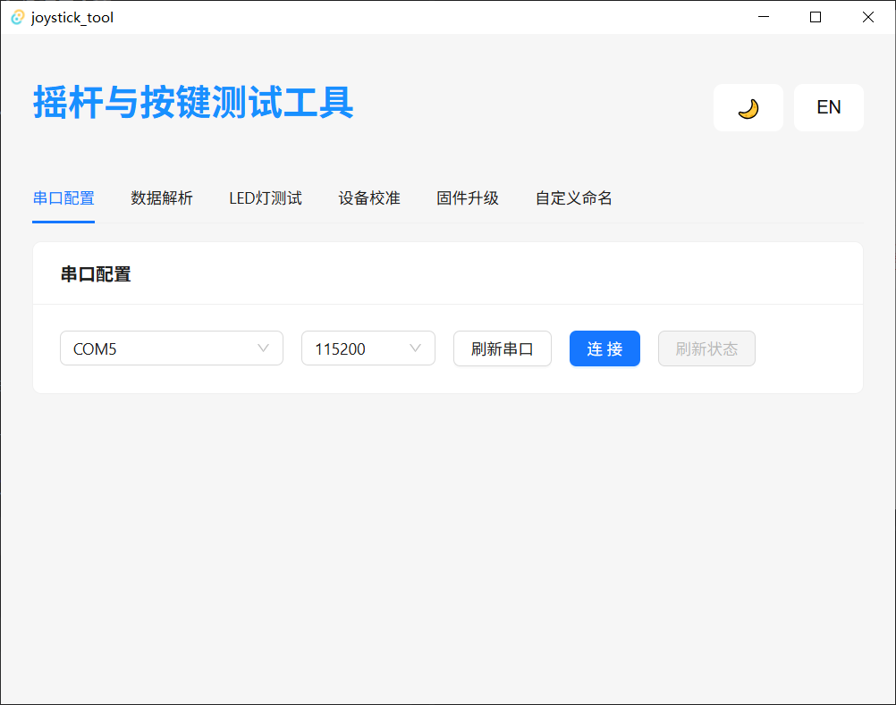
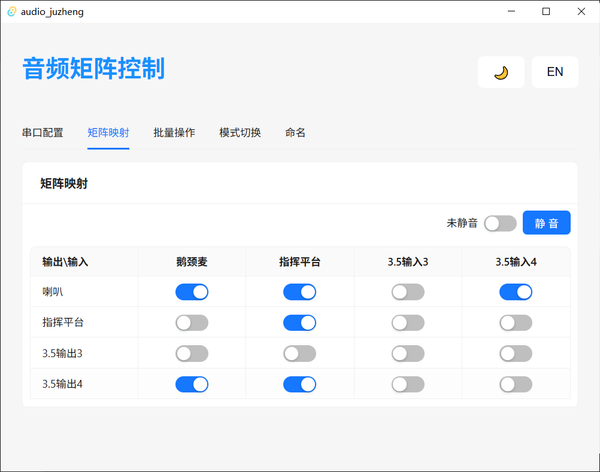
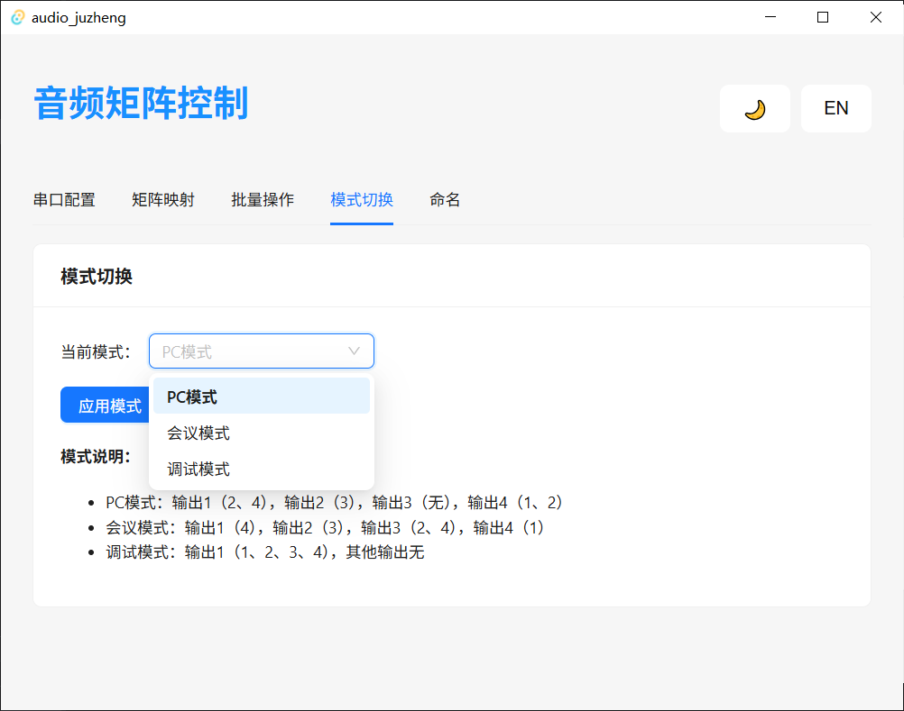

# 音频矩阵控制器

这是一个基于 Tauri + React + Rust 开发的音频矩阵控制应用，用于通过串口通信控制音频矩阵设备的输入输出映射和静音状态。

## 界面截图






## 技术栈

- **前端框架**: React 18 + Vite
- **构建工具**: Tauri（跨平台桌面应用框架）
- **后端语言**: Rust
- **UI 组件库**: Ant Design
- **状态管理**: React Hooks
- **国际化**: i18next
- **串口通信**: Rust serialport 库

## 功能特性

### 1. 矩阵映射控制
- 4x4 音频矩阵的输入输出映射管理
- 可视化界面展示当前映射状态
- 点击表格单元格即可设置映射关系
- 支持批量操作（将所有输出映射到同一输入）
- 支持一键清除所有映射

### 2. 静音功能
- 全局静音开关控制
- 支持通过开关或按钮操作
- 实时显示当前静音状态

### 3. 串口配置
- 自动扫描可用串口
- 支持多种波特率选择（9600, 38400, 57600, 115200）
- 连接状态实时监控
- 手动刷新串口列表和设备状态

### 4. 用户界面
- 响应式设计，适配不同屏幕尺寸
- 支持明暗主题切换
- 支持中英文语言切换
- 简洁直观的操作界面

## 通信协议

应用通过以下串口指令与音频矩阵设备通信：
- `EE 82`: 设置映射关系
- `EE 83`: 查询当前映射
- `EE 84`: 控制静音状态

## 安装和运行

### 开发环境

1. 安装 Rust 和 Cargo
2. 安装 Node.js 和 npm
3. 安装 Tauri CLI

### 运行项目

```bash
# 安装依赖
npm install

# 开发模式运行
npm run tauri dev

# 构建生产版本
npm run tauri build
```

## 项目结构

- `src/`: 前端代码（React）
- `src-tauri/`: 后端代码（Rust）
  - `src/matrix.rs`: 矩阵控制核心逻辑
  - `src/serial.rs`: 串口通信实现
  - `src/config.rs`: 配置文件管理
- `public/`: 静态资源

## 使用说明

1. 启动应用后，首先选择可用的串口和波特率
2. 点击"连接"按钮与音频矩阵设备建立连接
3. 在"矩阵映射"页面查看和修改输入输出映射
4. 使用静音开关或按钮控制全局静音状态
5. 在"批量操作"页面进行批量映射设置

## 配置文件

应用会在本地生成 `config.json` 文件，保存以下配置：
- 矩阵映射状态
- 静音状态
- 串口配置

## 注意事项

- 确保音频矩阵设备支持相同的通信协议
- 连接设备前请确认串口参数设置正确
- 操作过程中请勿关闭应用或断开设备连接
